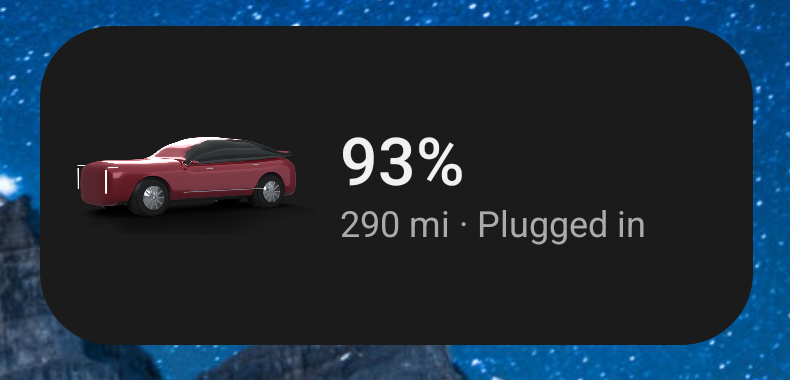
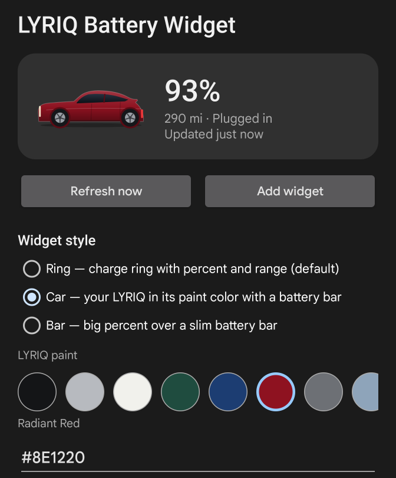

# LYRIQ Battery Widget

An Android home-screen widget that shows your EV's state of charge, range and charging
state. Built for the Cadillac LYRIQ, works with any car Smartcar supports or anything
Home Assistant can see.

<p align="center">
  
</p>

- **Three styles**: a Material You charge ring (default), your car drawn in its paint color
  over a battery bar, or a big percent over a slim bar. Every style has layouts for 2×1,
  2×2 and 4×2-and-up, and the widget resizes freely.
- **Real data, officially**: connects through [Smartcar](https://smartcar.com) with your
  manufacturer login (API V3), or reads entities from Home Assistant.
- **Tap to open myCadillac**, tap the ring/car/bar to refresh, long-press for settings.
- **Tiny and dependency-free**: framework-only Java, about 60 KB, no Gradle, no AndroidX,
  no analytics. Credentials never leave the phone.

<p align="center">
  
</p>

## Install

Download the newest APK from [`releases/`](releases) (or the latest GitHub release) onto
your Android 12+ phone, open it, install, then follow **[docs/SETUP.md](docs/SETUP.md)**.
The short version:

1. Create a free app at [dashboard.smartcar.com](https://dashboard.smartcar.com).
2. Paste its **Application ID**, **Client ID** (`client_…`) and **Client secret** into the
   app, and register the redirect URI the app shows (`sc<ApplicationID>://exchange`).
3. Tap **Connect vehicle**, sign in with your myCadillac / OnStar account, add the widget.

## Set it up with an AI agent

The repo ships agent instructions and skills so an assistant can do the setup with you:

- `AGENTS.md` / `CLAUDE.md`: architecture, hard rules, how to verify a change.
- `.claude/skills/setup-lyriq-widget`: guided Smartcar / Home Assistant setup with a
  troubleshooting map for every error the app can show.
- `.claude/skills/build-apk`: reproduces the build in a fresh sandbox, even where Google's
  SDK hosts are blocked.
- `.claude/skills/add-data-source`: how to add another car API.

Open the repo in Claude Code (or any agent that reads `AGENTS.md`) and ask "help me set up
the LYRIQ widget".

## How the battery gets to your phone

Inside the car, Google Maps reads the pack from the vehicle HAL (`EV_BATTERY_LEVEL`) on
Android Automotive, and Android Auto streams the same data from the head unit. Neither
path is available to third-party phone apps, and GM's own API is undocumented and
MFA-locked. Smartcar is the sanctioned route: an OAuth "Connect" flow with your OnStar
login, then a REST API. This app implements Smartcar's **API V3** (client-credentials app
token, `/v3/connections`, `/v3/vehicles/{id}/signals`) with the legacy V2 exchange as a
fallback for older dashboards.

| Source | You need | Notes |
| --- | --- | --- |
| Smartcar | Free dashboard app: Application ID, `client_…` Client ID, secret, redirect URI | 1 live vehicle and ~500 calls/month on the free plan; default refresh 120 min |
| Home Assistant | Base URL, long-lived token, battery entity (range and charging optional) | Works with onstar2mqtt entities |
| Demo | nothing | Place and resize the widget before connecting |

## Build

```sh
# Debian/Ubuntu, no Android Studio needed
apt-get install -y aapt apksigner zipalign dalvik-exchange android-sdk-build-tools zip
# android.jar for API 35 (and 33 for the older aapt2) under $ANDROID_HOME/platforms/
ANDROID_HOME=~/android-sdk ./build.sh
# -> build/out/lyriq-battery-widget.apk
```

`build.sh` runs `aapt2`, `javac`, `dx`/`d8`, `zipalign` and `apksigner`. With no keystore
present it generates a debug key, so anyone can build an installable APK; the maintainer's
release key comes from CI secrets. `.github/workflows/build.yml` builds on every push and
attaches the APK to `v*` tag releases. See `.claude/skills/build-apk/SKILL.md` for the
sandbox bootstrap.

## Project layout

```
app/AndroidManifest.xml              permissions, widget receiver, job service, myCadillac <queries>
app/res/xml/widget_info.xml          sizes, resize modes, configure activity
app/res/layout/widget_*.xml          ring / car / bar layouts for small, medium, large
app/src/.../LyriqWidgetProvider      responsive RemoteViews(Map<SizeF, RemoteViews>) per style
app/src/.../CarRenderer              LYRIQ side profile + battery bar (Canvas)
app/src/.../WidgetRenderer           charge ring + text formatting
app/src/.../SmartcarSource           Smartcar Connect, V3 token/connections/signals, V2 fallback
app/src/.../HomeAssistantSource      REST /api/states reader
app/src/.../RefreshJobService        JobScheduler periodic + expedited refresh
app/src/.../MainActivity             settings; also the widget's reconfigure screen
build.sh                             the build pipeline
docs/SETUP.md                        end-user guide
```

## License

[MIT](LICENSE). Not affiliated with Cadillac, General Motors, Smartcar or Google.
